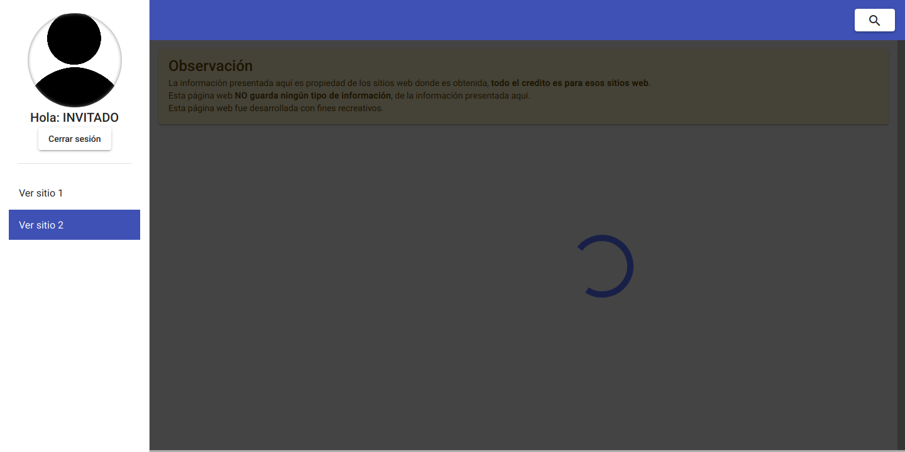

# the-anuncios_frontend


## Descripción
> Esta es la parte frontend del proyecto the-anuncios, la aplicación web fue desarrollada con la version 13.1.1 de angular, tiene las siguientes secciones:
> * Una página de autenticacion para controlar el ingreso, en base a google o resolver un captcha.
> * Una página que brinda información de anuncios de trabajo de un par de sitios web con un scroll infinito.


## Descargar las dependencias
```
npm install
```

## Iniciar el proyecto
```
Ejecutar `ng serve` para un iniciar un servidor de desarrollo. Navegar a `http://localhost:4200/`.
```

## Construir el proyecto
```
Ejecutar `ng build` para construir el proyecto para produccion. El proyecto construido sera almacenado en la carpeta `dist/`.
```

## Capturas de pantalla
<br>
<br>


## Información de referencia sobre Sign In With Google 

[https://developers.google.com/identity/gsi/web/guides/overview](https://developers.google.com/identity/gsi/web/guides/overview)<br/>
[https://developers.google.com/identity/gsi/web/guides/verify-google-id-token](https://developers.google.com/identity/gsi/web/guides/verify-google-id-token)<br/>


## Información de referencia sobre Google Recaptcha

[https://developers.google.com/recaptcha/intro](https://developers.google.com/recaptcha/intro)<br/>
[https://www.npmjs.com/package/ngx-captcha](https://www.npmjs.com/package/ngx-captcha)<br/>
[https://developers.google.com/recaptcha/docs/verify](https://developers.google.com/recaptcha/docs/verify)<br/>


## Ver proyecto

[Clic aquí](https://anuncios-angular.fly.dev)


